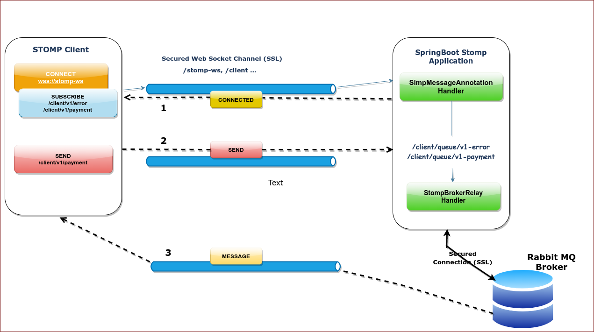

# Spring Boot, STOMP & RabbitMQ

STOMP is a Sub protocol for WebSockets communication. Spring Boot provides integration with STOMP through stomp starter dependencies. Spring Boot also offers connecting with external brokers such as RabbitMQ, ActiveMQ etc. which support the AMQP semantics.

Integration with STOMP clients with the help of spring boot can be facilitated by an in-memory broker created by Spring or it can relay messages to an external broker(for more advanced and production use-cases).

External broker such as RabbitMQ provides the option of routing messages through its messaging infrastructure like exchanges, topics or queues. The application is at liberty to decide based on its requirement what suits its need the most, a one to one queue or a broadcasting  topic etc.


## Spring STOMP & RabbitMQ

STOMP over WebSocket support is available in the spring-messaging and the spring-web socket modules. Once you have those dependencies, you can expose a STOMP endpoints, over WebSocket.

### Spring Boot & External Broker




The simple broker is great for getting started but supports only a subset of STOMP commands (e.g., no acks, receipts, etc.), relies on a simple message sending loop, and is not suitable for clustering. As an alternative, applications can upgrade to using a full-featured message broker.
Enable the STOMP broker relay in the Spring configuration instead of the simple broker.

Below is example configuration that enables a full-featured broker:

```
@Configuration
@EnableWebSocketMessageBroker
public class WebSocketConfig implements WebSocketMessageBrokerConfigurer {

    @Override
    public void registerStompEndpoints(StompEndpointRegistry registry) {
        registry.addEndpoint("/portfolio").withSockJS();
    }

    @Override
    public void configureMessageBroker(MessageBrokerRegistry registry) {
        registry.enableStompBrokerRelay("/topic", "/queue");
        registry.setApplicationDestinationPrefixes("/app");
    }
}
```

A STOMP broker relay maintains a single "system" TCP connection to the broker.

The STOMP broker relay also creates a separate TCP connection for every connected WebSocket client. You can configure the STOMP credentials to use for all TCP connections created on behalf of clients as the clientLogin/clientPasscode properties with default values guest/guest.

The messaging medium to be used queue, topic or exchange can be controlled from the application level. 
For e.g., if the requirement is to establish a dedicated one-to-one queue between server and client. The client subscriptions can be like:

```
/client/queue/work
```

for topic destinations, the subscriptions can be as below:

```
/client/topic/work
```

Other properties of these queues/topics can be controlled by setting appropriate headers while routing messages from Spring application to RabbitMq: For e.g.,

Queue properties can be controlled via STOMP headers:

- durable (aliased as persistent)
- auto-delete
- exclusive

## Benefits with an external broker
- Durable/Persistent Subscriptions
- Support for temporary queues.
- Dead lettering support
- TLS/SSL Support with RabbitMQ STOMP plugin


## Observations

1. The ACK or acknowledgments are sent to the producer right after the broker captures the message. This receipt is not adequate for reliable delivery since the message hasn't been sent to the consumer yet.
2. RabbitMQ STOMP plugin enforces subscription semantics. For simple queues, destinations of the form `/queue/<name>` can be used. Similar convention can be followed for subscribing to `topic` or `exchange`  destinations.


